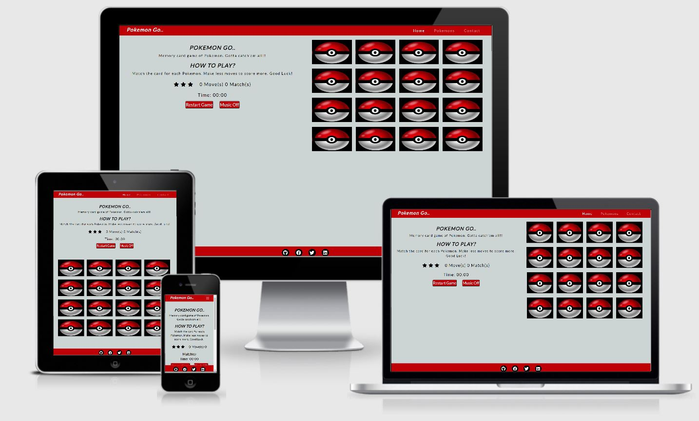

# Pokemon Go...
## A memory game website by Kiran Satyarthy

[View live site here](https://kiran6248.github.io/MS2-PokemonGo/index.html)

**Pokemon go** is a memory game, built by me for my Second Milestone project for Code institute.

It also has some description about the *pokemons*. This site is made by using **HTML**, **CSS** and **Javascript**.
***

## **Table of Content**

* [Overview](#overview)
* [User Stories](#user-stories)
* [UX](#ux)
* [Features](#features)
* [Technologies used](#technologies-used)
* Resources
* Testing
* Project Barriers & Solutions
* Code Validity
* Version Control
* Deployment
* Credits
* Acknowledgments

## **Overview**

This project is made by using famous **Pokemons**, also known as *Pocket Monsters*. They are managed by "The Pokemon Company" founded by "**Nintendo**". The purpose of this project is to make a fun memory game both for kids and adults. Kids will enjoy the interactive game with beautiful images and funny sound clips,and adults can be nostalgic while playing with pokemons from their childhood times. There is an information about pokemons section with details of strength, weakness, speed etc., for more enthusiastic players, who wants to learn and know more while they play. 

Check [Wikipedia](https://en.wikipedia.org/wiki/Pok%C3%A9mon) of Pokemon to know more about them.
***

## **User Stories**

**The suitable users for his site will be 5+ kids and adults.**

* As a kid, I want to play easily and also see my score.
* As a kid, I want to see pictures of my favourite pokemon and recognize them.
* As a kid, I want to know how much time I took to finish the game.
* As a kid, I want to restart the game if i make a mistake.
* As an adult, I want to catch my favourite pokemon once again.
* As an adult, sometimes i dont want any background sound and want to mute everything.
* As an adult, I want to learn about vital statistics of pokemon.
* As an adult, I want to contact the maker of the game, and give my feedback.
* As an adult, I want to easily navigate through pages.
***

## **UX**

### **1.Strategy**

The aim of building this memory game is to test my knowledge of **Javascript** and learn more in the building process. The Pokemon is selected for the memory game because they are very famous game characters and whoever plays online games knows them. I wanted a simple game that has rules which are easy to understand and the site is easy to navigate through.

### **2.Scope**

I wanted to make memory game which is easy to play and images should be different from each other, so that it will test the memory of the user.

There will be one **Score Counter**, one **Restart** button and one **Music Off** button to control the sound of the game (it can be muted).

After finishing the game, one popup message will show the **Moves** taken and **Stars** gained during the game.

There will be a **Timer** which will show the time taken to complete the game in minutes and seconds.

The site will have information about the Vital Statistics of the pokemon used in the game.

There will be a Contact Form to get feedback from the players and links to Social Networks will also be there.

### **3.Structure**

This website will be a three page website, linked to each other through Navigation Bar. The website will have a fixed **Navigation Bar**, that will have brand name and menu links( *Home, Pokemons, Contact*). The Header section will have Introduction of the game, How to play instructions, Moves and match counter, one timer to show the game timing in minutes and seconds, one star counter (which will show 3 stars for less than 14 moves, 2 stars for moves between 14 and 22, and 1 star for moves more than 23). 

The memory game will be on Home page, because that is the main feature of the site. Second page will have *Pokemon selector dropdown box* which will be designed by using **JavaScript** and it will show different types of Pokemon and their Vital statistics in a **Progress bar** after selection.

The last page will have one *Contact Form* to give feedback about the game and the website.

Footer will be fixed in the bottom and will have links to my social account.

### **4.Skeleton**

*Wireframe* : The wireframe for this 3 page project was made for three screen sizes(Mobile View, tablet view and Laptop view). Each page is shown in all three screen sizes in a single page for better understanding of the responsiveness of the page.

The Wireframe for this project can be seen here .

*Fixed Navigation Bar* : Menu heading pointing to each of the 3 pages.

*Home, Pokemons and Contact pages*.

*Footer* with social media links shown by their fontawesome icons.

### **5.Surface**

**Colours**:

The colour theme is selected from original Pokeball colours. The background colour is kept Greyish Blue(#ccd4d4), Navigation and footer colour is Dark Red (#BD0107) and font colour is kept black(#000) and white(#fff) according to the background.

**Typography**:

Google Font **Lato** with fallback of **sans sarif** is selected for the entire project. (This font was choosen because this is the font of Pokemon go Official site)

**Images**:

Images are of real pokemon.

**Sound**:

The background music is cheeky_monkey_fun_app_playful_cheeky from Zapsplat.com.
***

## **Features**

**Navigation Bar**

This website features a **Responsive** navigation bar on the top of the page with the brand name on the left and Menu links on the right. The brand name is linked to the Home page of the site. Menu links are linked to 3 different pages of the site. Home link is linked to the **index.html** page, Pokemon link is connected to the second page **pokemon.html** and the third link is contact, which is connected to the third page **contact.html**.

**Home**

The Home page is having the **Game board**, which is a 4X4 grid with total 16 images. The back-image is of **Pokeball** and the front image is of 8 different pokemons.

* Arcanine
* Charizard
* Eevee
* Gengar
* Jigglypuff
* Meowth
* Mewtwo
* Pikachu

 The **Heading** have name of the game and  Instruction about **How to play** the game.
 
**Moves and matches counter** shows how many moves have been made and how many matches have been done.

**Star ratings** will show the numbers of stars based on the moves made by th player, 3 stars for less than 14 moves, 2 stars for moves between 14 and 22 and 1 star for moves more than 23.

**Timer** will show the time taken by the player to finish the game in minutes and seconds.

**Restart button** will restart the game when clicked.

**Music Off** button will mute the background music. The background music will be started when the game is started again.

**Pop Up** modal is added to show when the game is finished. It will show the number of moves taken to complete the game and number of stars earned during the game. The timer in the modal shows time taken to complete the game.

**Pokemon**

The second page of the website is the information page about the Pokemon. This has one dropdown box to select a pokemon, and after selection the page will show the **Vital statistics** and one big **Image** of the selected pokemon. Vital statistics is shown by using **Progress bar** which will have parameters of *Health Points*, *Attack*, *Defense*, *Special Attack*, *Special Defense* and *Speed*.

**Contact**

The third page of the website has a **Contact form**, which is implemented to give feedback about the game. The contact form is connected to my gmail account through **emailJS**, and the feedback submit button will become green and its text will turn to *Feedback Sent* after sending the feedback.

**Footer**

The footer is fixed in the bottom in all 3 pages and it has link to 4 social networks **Facebook**, **Github**, **Twitter** and **LinkedIn**.The links are represented by their *fontawesome* icons. The links open in a separate page when clicked.

**Existing Features**

* Navigation Bar- Navigation bar is fixed and can be seen always on top.

* Moves and matches counter- This counter will show number of maves made and number of matches done during the game.

* Star rating- This feature is added to give the feedbeck to the player about their game.

* Timer- One timer is added which starts with the first card clicked and it will show time taken to complete the game.

* Restart Button- One restart button is added to reset the board and restart the game. 

* Music Off- One music off button is added to mute the background music, which is starting with the first card clicked.

* Dropdown box- One dropdown box is added with names of pokemons in it to be selected.

* Progress Bar- progress bar is added for each pokemon to show their vital statistics.

* Contact Form- Contact form is added to give feedback about the game.

* Social Network Links- Links to my social networks Github, Facebook, Twitter and Linkedin is provided in the footer.

**Features to be implemented in the future**

* A difficulty level selector can be added in the future, to select the levels between Easy, Medium and Hard.

* Sound effect when the card are matched, can be added.

* Sound Effect of different pokemons can be added.

* Some animation of Pokemon can be added to make the site more interesting.

* Pop up message can be added when thr form is submitted to tell about the success or error in submission.
***

## **Technologies Used**

**1. Languages Used**

* [HTML](https://en.wikipedia.org/wiki/HTML)

  HTML is the main language used to write code for this project.

* [CSS](https://en.wikipedia.org/wiki/CSS)

  CSS is used to write code for designing and beautifying the site.

* [JavaScript](https://en.wikipedia.org/wiki/JavaScript)

  Javascript is used to add functionality and make the site more interactive.

 **2. Integration**

 * [BootstrapCDN](https://getbootstrap.com/) 

   Bootstrap is used to make the site more respomsive and to make the navbar collapse in the mobile view. All the pages and footer is made using Bootstrap container, to give them a definite size.
 
* [jQuery](https://jquery.com/)

  jQuery is used in making the site more interactive.

* [Font Awesome](https://en.wikipedia.org/wiki/Font_Awesome)

  Font awesome is used to import Github, Facebook, Twitter and Linkedin fontawesome icons to beautify the page.

* [Google Fonts](https://fonts.google.com/)

  Google Fonts is used to import font for this project. The font used in this project is "Lato".

* [Balsamiq](https://en.wikipedia.org/wiki/Balsamiq)

   Balsamiq is used to make wireframes for this project in the skeleton stage.

**3. Workspace, version control and Repository storage**

* [Github](https://en.wikipedia.org/wiki/GitHub)  

   Github is used to make **Repositories** and for **Version Control**.

* [Gitpod](https://www.gitpod.io/)

   Gitpod is main cloud based editor for this project. Workspaces are made using the green Gitpod button in the Github.

**4. Other**

* [AutoPrefixer](https://autoprefixer.github.io/)

  AutoPrefixer is used to make the site compatible in all browsers.

* [W3C Validator](https://validator.w3.org/)

  W3C validator is used for testing HTML and CSS for the site.

* [JSHint](https://jshint.com/)  

  JSHint is used for testing javascript code for the site.

* [Am I Responsive](https://amiresponsive.co.uk/)

  Am I Responsive site is used to take a mockup screenshot of the project, which is attached at the beginning of this document.

* [Online Spelling Check](https://www.grammarly.com/)

   Grammerly is used to check spelling and grammetical errors.
 ***

 ## **Resources**

 * [Code Institute Course Content](https://courses.codeinstitute.net/program/FullstackWebDeveloper)- Main source of fundamental knowledge.

 * Code institute **Slack Community**- Main source of assistance.

 * [Stack Overflow](https://stackoverflow.com/)- General Resources.

 * [Youtube](https://www.youtube.com/)- General Resource.

 * [iColorpalette](https://icolorpalette.com/)- Find relevant colour palette for the site.

 * [TinyPNG](https://tinypng.com/)- Efficient compression of images for site.

 * [Am I Responsive](http://ami.responsivedesign.is/)- Responsive website mockup image generator.

 * [Balsamiq](https://en.wikipedia.org/wiki/Balsamiq)- Wireframing design tool.

 * [Memory Game Tutorial by Marina Ferreira ](https://marina-ferreira.github.io/tutorials/js/memory-game/)- Game board and game functionality design.
 ***

 

  

 

