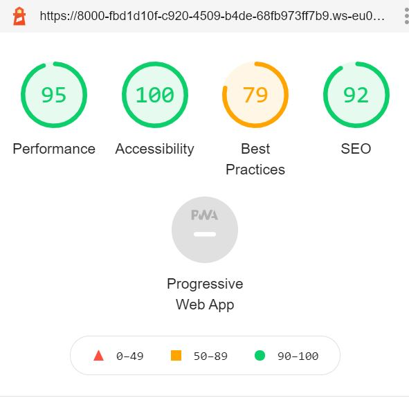
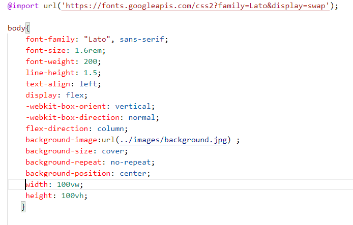

# Pokemon Go...
## A memory game website by Kiran Satyarthy- Testing details

[Main README.md file](README.md)

[View live site here](https://kiran6248.github.io/MS2-PokemonGo/index.html)

## Testing

[W3C Markup Validation Service](https://validator.w3.org/)

* W3C markup validation service is used for the testing of the **HTML** of all 3 HTML pages and **no error** was found.

    The results can be seen here.

* [index.html](assets/docs/index-test.JPG)
* [pokemon.html](assets/docs/pokemonhtml-test.JPG)
* [contact.html](assets/docs/contacthtml-test.JPG) 
This file was showing an error that "type" is not required for javascript, So I removed the type from javascript cdn in the head element and now the page is error free.

[W3C CSS Validation Service](https://jigsaw.w3.org/css-validator/)

* W3 CSS validation service is used for the testing of the **CSS** of the project and no error was found.

    The result can be seen here.

* [style.css](assets/docs/css-test.JPG)

[JSHint](https://jshint.com/)

* JSHint, a JavaScript code quality tool was used to test the **JavaScript** codes of all 3 js pages from the project.

    The result can be seen here.

* [main.js](assets/docs/mainjs-test.JPG) After running the main.js file through jsHint, some warnings were appearing, that "let" and "const" is available in ES6 or use Mozilla extension. I replaced all let and const variables by "var" and that warnings are gone. Still, some warnings about Arrow function syntax is appearing, which can be ignored.

* [pokemon.js](assets/docs/pokemonjs-test.JPG) This file is mainly made by jQuery, so when testing it through jsHint, It was showing $ as an undefined variable, this can be ignored.

* [contact.js](assets/docs/contactjs-test.JPG) This file was showing no error.

 The Project was tested for Browser compatibility. It was found that the game was not working on mobile devices, the cards were not flipping. Which was fixed by checking codes in **AutoPrefixer.github.io** and updating the CSS. That issue is resolved now.
 ***

 ### **Client Stories Testing**

Testing client stories from UX part of [README.md](README.md) 

1. As a kid, I want to play easily and also see my score.
    * The game is a simple memory game with no complicated instructions. The instrustion is given below the name of the game. A kid will easily understand what he/she has to do. 
    * The score comes in the side with every move and match. If they are playing on mobile then the score will be seen on the top. At the end of the game, the popup also shows the score.

2. As a kid, I want to see pictures of my favorite pokemon and recognize them.
    * The second page of the game is the information page about pokemon. Kids can easily see the vital statistics of each pokemon.
    * Different pokemon can be selected by using the dropdown box selector.

3. As a kid, I want to know how much time I took to finish the game.
    * A timer is given with the game, which starts as the first card clicked and stops with the last match of cards.
    * The popup message also shows the time taken to complete the game.

4. As a kid, I want to restart the game if I make a mistake.
    * One restart button is given which resets the board when clicked.
    * The restart button also restarts the music.

5. As an adult, I want to catch my favorite pokemon once again.
    * Pokemon is a favorite game character for many years, many grown-up people would love to watch the images after a long time.

6. As an adult, sometimes I don't want any background sound and want to mute everything.
    * One Music Off button is given to stop the music at any point in the game. 
    * The music will be restarted with the restart button or by restarting the game.

7. As an adult, I want to learn about the vital statistics of pokemon.
    * The pokemon page shows vital statistics of different pokemon in the form of a progress bar. 
    * It is easy to read and compare two pokemon.

8. As an adult, I want to contact the maker of the game and give my feedback.
    * One contact form is provided on the contact page with space to write the feedback about the game.
    * Social network links are also provided in the footer at the bottom of every page.

9.  As an adult, I want to easily navigate through pages.
    * The navigation bar is fixed at the top of the site. the navbar has links to all 3 pages of the site and they can be navigated easily.
***

### **Manual Testing of all elements and functionality of every page.**
#### **Home Page**
* **Navigation Bar**

1. Check if the **navigation bar** is fixed always on top.
2. Click the Brand name, check if the **Home** page opens.
3. Click the **Home** link, check if the page stays on the home page.
4. Click the **Pokemon** link, check if the pokemon page opens.
5. Click the **Contact** link, check if the Contact page opens.
6. Check for **Responsiveness** in mobile view, the navigation bar collapsed in the hamburger icon.
7. Check in the mobile view if all links are opening to respective pages. 

* **Instruction And Moves division**

1. Check for the spelling and content in the instruction and Heading.
2. Click on the card and start the game, check if the **move counter** is increasing with every click.
3. Click on the card and start the game, check if the **match counter** is increasing with every match.
4. Click and play the game and check after how many clicks the **stars** started to collapse. It was observed that the stars collapsed from 3 to 2 after 14 clicks, from 2 to 1 after 23 clicks.
5. Start playing the game and check if the **Timer** starts working with the first click, and stops with the last match of the cards.
6. Click the **Restart** button, check if it resets the board at any point in the middle of the game.
7. Click the **Music Off** button, check if it stops the music when clicked at any point of the game.
8. Go in mobile view and repeat steps 1 to 7, check everything is working.

* **Game Board**

1. Check the game board to be in the **4X4** grid view.
2. Click the first card and start playing, check if the card turns and stays.
3. Click the second card and check if it is not a match then both the first and second card will turn back and if it is a match both will stay on the pokemon image and the match counter increases.
4. Click the third card, check if the move counter increases.
5. Repeat for every card.
6. Click the first card, check the **music** starts.
7. Repeat steps 1 to 6  for every card.
8. Click and finish the game, check if the music stops.
9. Finish the game, check if counters and timer stop.
10. Finish the game, check one **popup modal** appears with congratulation message, moves and stars details, and time taken information.
11. Click the **X** button on the top right of the popup, check if the closes and the game board resets.
12. Go to the mobile view, check if the board fits in the viewport.
13. Repeat steps 1 to 11 in the mobile view and check for responsiveness.

* **Footer**

1. Check the **Footer** is always fixed at the bottom of the page.
2. Click the **Github** link, check if it opens my Github page on a different page.
3. Click the **Facebook** link, check if it opens the Facebook login page.
4. Click the **Twitter** link, check if it opens the Twitter login page.
5. Click the **Linkedin** link, check if it opens the Linkedin login page.
6. Go to the mobile view and check for **responsiveness**.
7. Repeat steps 1 to 5 in the mobile view.

#### **Pokemon Page**

* **Navigation Bar**

1. Click the **Brand name**, check if it opens the home page.
2. Click the **Home** link, check if it opens the home page.
3. Click the **Pokemon** link, check if it stays on the page.
4. Click the **Contact** link, check if it opens the contact page.
5. Repeat steps 1 to 4 in the mobile view, it was observed that the page is not fixed, this can be considered as a bug on the page.

* **Pokemon Selector**

1. Click the **Dropdown button**, check the name of 8 pokemon that appears.
2. Click on each link and check if the respective pokemon's **Progress bar** and the **Image** appears.
3. Check for **responsiveness**, if it stays in the viewport.

* **Progress Bar**

1. Check the spelling of the **Heading** and content.
2. Check the **Progress bar**, they are 6 in numbers.
3. Select different pokemon from the pokemon selector and check if the progress bar changes accordingly.
4. Check for **responsiveness**, if it fits in the mobile view.

* **Image section**

1. Check if the **Images** matches with the particular pokemon.
2. Check the **responsiveness** of the image in tablet and mobile view.
3. Check if the image doesn't stretch or squeeze in different views.

* **Footer**

    The testing of the footer is the same as in the home section.

#### **Contact Page**

* **Navigation Bar**

1. Click the **Brand name**, check if it opens the home page.
2. Click the **Home** link, check if it opens the home page.
3. Click the **Pokemon** link, check if it opens the pokemon page.
4. Click the **Contact** link, check if it stays on the page.
5. Repeat steps 1 to 4 in the mobile view.

* **Contact form**

1. Check spelling and content in the form.
2. Check the **Name** section and the form, check if it allows writing.
3. Check in the **Email** section, check if it gives a message when the email format is not correct.
4. Write some text in the **Feedback** area, check if it allows writing more than 3 lines.
5. Click the **Submit** button, check if the email is received in the recipient email address.
6. Click the submit button, check it turns **green** color after submitting, and its text changes to `"Feedback Sent"`.
7. Check if the page refreshes after form submitting, this happens but the button remains green and does not changes for the new submission.

* **Footer**

    The testing of the footer is the same as in the home section. 
***  
### **Responsiveness**

* DevTools- Devices tested across a range of widths: iPhone5(320px)| Samsung S5(360px)| iPhone6/7/8/X(375px)| iPhone6/7/8 Plus(414px)| iPad(768px)| iPad Pro(1020px)| Laptop(1200px)| Large Desktop Screen(1920px)
* Viewed site on above range on various browsers: Google Chrome, Firefox, Opera, Safari.
* Viewed on physical devices: small phone(320px)| Large phone(414px)| large tablet(768px)| mediu, laptop(1366px)| Large Desktop Screen(1920px)
***

### **Lighthouse testing**

The finished site was checked through Lighthouse Developer tool and the result found is attached here.

The best practices section showing `amber` because of low resolution of the images, which I kept purposefully to load the page faster.

### **Project Barrier**

* The CDN for emailjs is updated and because of that, there should be a change in the javascript code for that. which I was unaware of. Later on, I got help from a fellow student through slack and that issue was resolved.

* The background image which I was planned to use was not becoming responsive after many attempts and help, so I decided to remove it and changed the theme to the Pokeball color theme.
 The code I was using earlier can be seen here.
 
 

 This was replaced by `background-color: #ccd4d4`

### **Bug report**

* The pokemon page is not fixed in the mobile view.

* The contact form submit button  does not become to submit when writing new feedback after submitting the first form.
***

